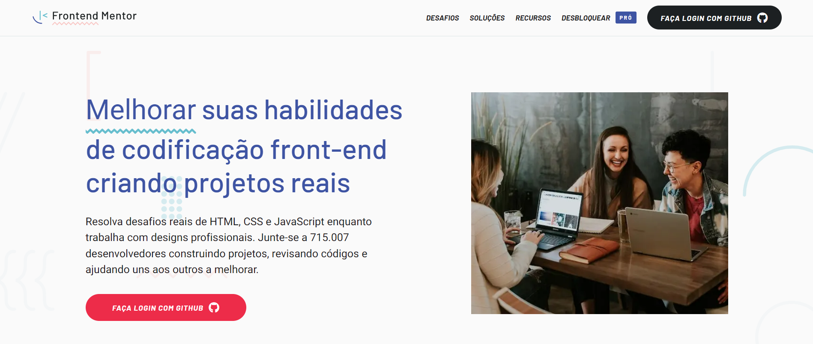

# Frontend Mentor

   

 
 
##### Este repositório foi criado para exibir minhas resoluções dos desafios proposto pelo Frontend Mentor.

### 🤔 Mas o que é o Frontend Mentor? 
O <a  href="https://www.frontendmentor.io/"> Frontend Mentor</a> é um site que permite ter acesso a diversos desafios envolvendo <b>HTML, CSS e JS</b> com o objetivo de aprimorar as habilidades na área. A maioria dos desafios são gratuitos e você pode selecioná-los a partir do seu nível(básico, intermediário e avançado).
  

### :woman_shrugging: Como faço para iniciar o desafio?
Antes de tudo, é importante que você crie uma conta no <a  href="https://www.frontendmentor.io/"> Frontend Mentor</a> e vincule sua conta do GitHub à plataforma.
Feito isso, basta você selecionar o desafio que mais gostou e clicar em <b>Start Challenge</b>. Pronto, agora é só baixar o arquivo vinculado ao desafio e começar a codar :D.
  

### :octocat: É possível contribuir com o projeto?
Siiim, é possível! Ao acessar a plataforma e clicar no seu perfil é possível visualizar todos os seus desafios que você iniciou e ao concluí-los você poderá clicar em <b>Submit Solution</b> e enviar as suas soluções para a plataforma.   
  

### :rocket: Desafios Concluídos (até o momento)

- <a href="https://github.com/nicolyyy/frontend-mentor/tree/master/challenge-01"> Pricing component with toggle</a>

- <a href="https://github.com/nicolyyy/frontend-mentor/tree/master/challenge-02">Insure landing page</a>

- <a href="https://github.com/nicolyyy/frontend-mentor/tree/master/challenge-03">Fylo landing page</a>

- <a href="https://github.com/nicolyyy/frontend-mentor/tree/master/challenge-04">Coding Bootcamp Testimonials Slider</a>

- <a href="https://github.com/nicolyyy/frontend-mentor/tree/master/challenge-05">Social media dashboard with theme switcher</a>

<<<<<<< HEAD
=======
<h2>🚀 Desafios Concluídos (até o momento)</h2>
<ul>
<li><a href="https://github.com/kaili0n/Desafios-Frontend-Mentor/tree/main/Projeto%201%20-%20Product%20preview%20card%20component"> Product preview card component</a></li>
<li><a href="https://github.com/kaili0n/Desafios-Frontend-Mentor/tree/main/Projeto%202%20-%20QR%20code%20component">QR code component</a></li>
</ul>
>>>>>>> 528384579c384295de75b2dc3636ac69724fd416
